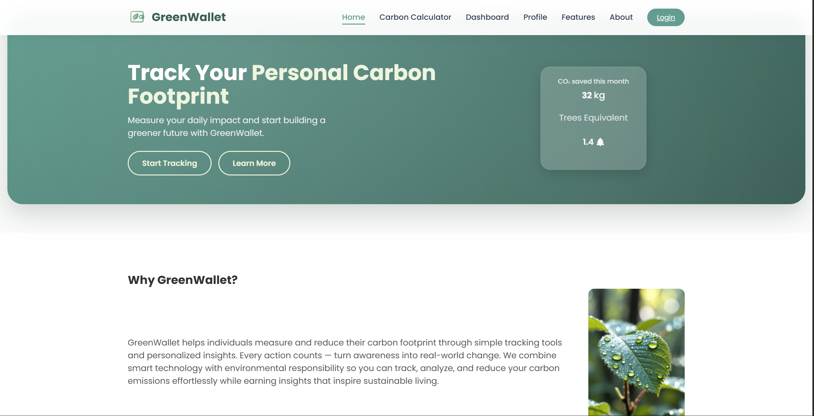
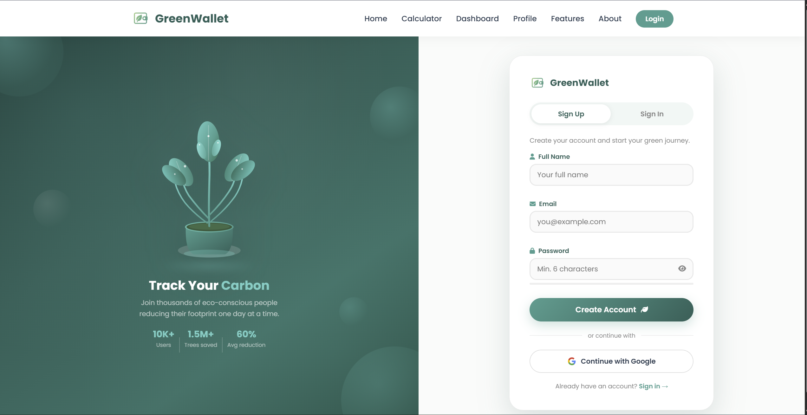
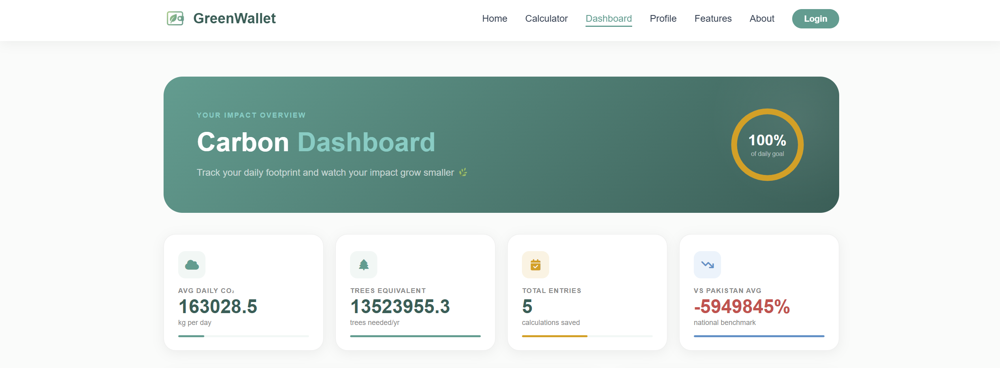
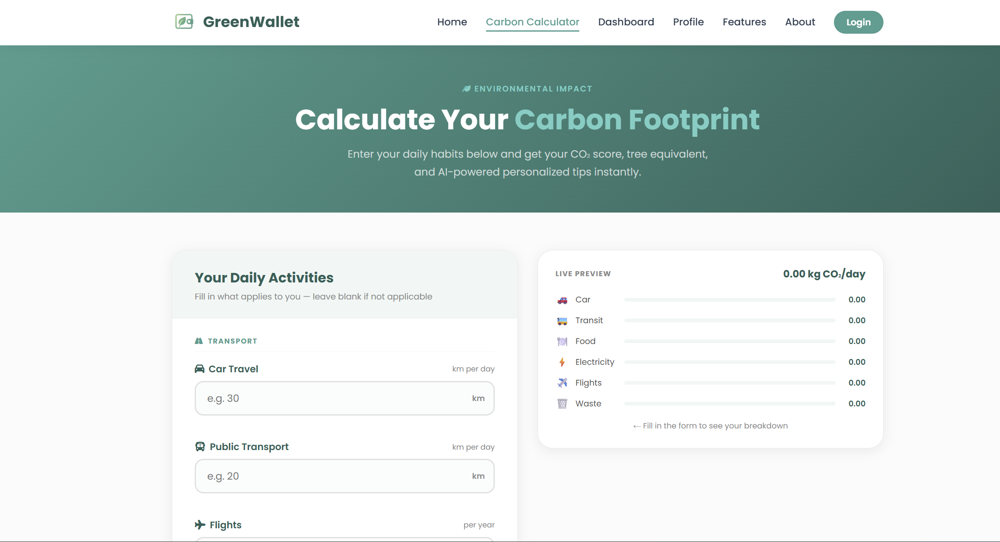
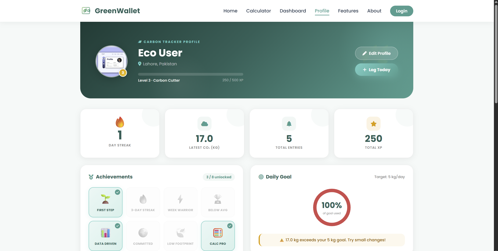
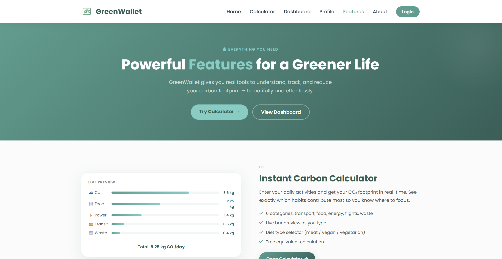
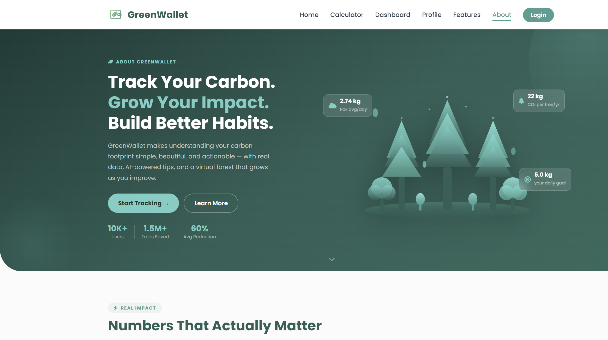

<div align="center">



# 🌿 GreenWallet

### Your Personal Carbon Footprint & Eco Finance Tracker

*Track your environmental impact. Make greener choices. Live sustainably.*


[🌐 Live Demo](#) · [⚡ Quick Start](#-quick-start) · [📸 Screenshots](#-screenshots) · [🤝 Contribute](#-contributing)

> ⚠️ Live demo coming soon — backend integration in progress!

</div>

---

## 📌 About

**GreenWallet** is a web application that helps users track their carbon footprint, monitor eco-friendly habits, and make more sustainable lifestyle choices every day. The platform combines personal analytics with environmental impact awareness to inspire greener decisions.

> 🌱 Frontend complete with vanilla HTML, CSS, and JavaScript. Backend (Node.js + MongoDB) coming soon.

---

## ✨ Features

### 🏠 Home Page
- Hero section with platform introduction and live CO₂ stats
- "How It Works" section with step-by-step guide
- Sustainable Living Blog with eco tips
- Impact statistics — Trees Saved, Carbon Reduction Goal, Daily Users

### 🔐 Authentication
- Clean Sign Up / Sign In UI with tab switching
- Google Sign-In integration (UI ready)
- Form validation and error handling

### 📊 Dashboard
- Personal carbon footprint overview
- Daily streak and XP tracking
- Eco spending and activity summary
- Interactive charts and progress indicators

### 🧮 Carbon Calculator
- Calculate emissions from transport, food, and energy
- Visual results with reduction suggestions
- Instant CO₂ impact feedback

### 👤 Profile Page
- User profile with eco level and XP progress
- Achievement badges system
- Daily goal tracker with progress ring
- Carbon entry history

### 🌟 Features & About Pages
- Platform mission and vision
- Detailed feature showcase
- Team and project information

---

## 🛠️ Tech Stack

| Layer | Technology |
|-------|-----------|
| Markup | HTML5 |
| Styling | CSS3 (Custom + Responsive) |
| Logic | Vanilla JavaScript (ES6+) |
| Auth UI | Dynamic navbar with session awareness |
| Icons | SVG / Custom Assets |
| Fonts | Google Fonts |

---

## 📁 Project Structure

```
greenwallet-frontend/
├── index.html                  # Landing / Home page
├── login.html                  # Sign Up & Sign In
├── dashboard.html              # User dashboard
├── carbon-calculator.html      # Carbon footprint calculator
├── features.html               # Features showcase
├── about.html                  # About page
├── profile.html                # User profile
│
├── styles.css                  # Global styles
├── dashboard.css               # Dashboard styles
├── login.css                   # Auth styles
├── features.css                # Features styles
├── about.css                   # About styles
├── profile.css                 # Profile styles
├── carbon-calculator.css       # Calculator styles
├── navbar-auth-styles.css      # Navbar styles
│
├── script.js                   # Global scripts
├── dashboard.js                # Dashboard logic
├── login.js                    # Auth logic
├── features.js                 # Features logic
├── about.js                    # About logic
├── profile.js                  # Profile logic
├── carbon-calculator.js        # Calculator logic
├── navbar-auth.js              # Dynamic auth navbar
├── api.js                      # API integration layer
│
├── screenshots/                # Project screenshots
└── images/                     # Assets and images
```

---

## ⚡ Quick Start

### Prerequisites
- Any modern web browser (Chrome, Firefox, Edge)
- VS Code with Live Server extension (recommended)

### Run Locally

**Option 1 — VS Code Live Server**
```bash
git clone https://github.com/mehmoona-chand/greenwallet-frontend.git
cd greenwallet-frontend
# Right-click index.html → Open with Live Server
```

**Option 2 — Direct browser**
```bash
git clone https://github.com/mehmoona-chand/greenwallet-frontend.git
# Open index.html directly in your browser
```

---

## 📸 Screenshots

### 🏠 Home Page


---

### 🔐 Login & Sign Up


---

### 📊 Dashboard


---

### 🧮 Carbon Calculator


---

### 👤 Profile Page


---

### 🌟 Features Page


---

### ℹ️ About Page


---

## 🗺️ Roadmap

- [x] Frontend UI — all pages complete
- [x] Responsive design across all pages
- [x] Dynamic auth-aware navbar
- [x] Carbon calculator with instant results
- [x] Achievement and XP system UI
- [ ] Backend API (Node.js + Express)
- [ ] MongoDB database integration
- [ ] JWT authentication
- [ ] Google OAuth integration
- [ ] Newsletter subscription
- [ ] Live leaderboard
- [ ] Deploy to Render

---

## 🤝 Contributing

Contributions are welcome! Here's how:

1. Fork the repo
2. Create a branch: `git checkout -b feature/your-feature`
3. Make your changes and commit: `git commit -m "feat: add your feature"`
4. Push: `git push origin feature/your-feature`
5. Open a Pull Request

---

## 👩‍💻 Author

**Mehmoona Chand (Sylvia)**  
BS Information Technology   
Dev Weekends Fellow 2026 | Aspiring DevOps & Cloud Engineer

[](https://linkedin.com/in/mehmoonachand)
[](https://github.com/mehmoona-chand)

---

<div align="center">

⭐ **Star this repo if you find it useful — it means a lot!**

Built with 💚 for a greener tomorrow

</div>
